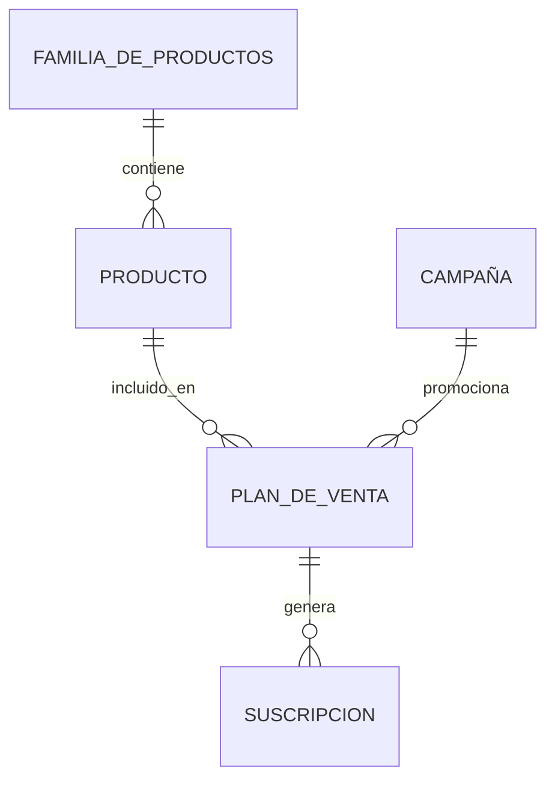
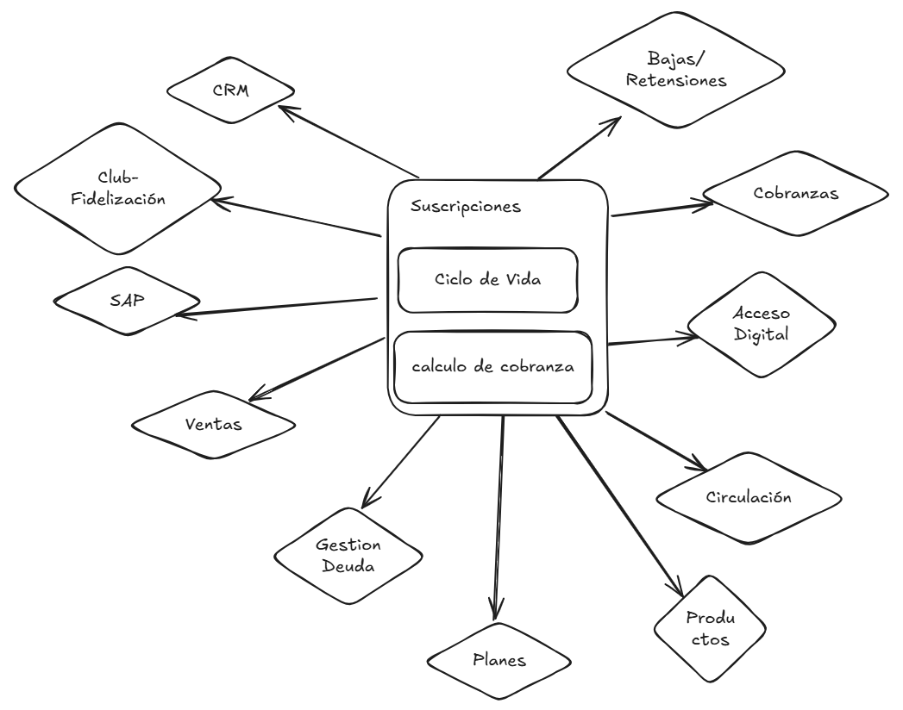
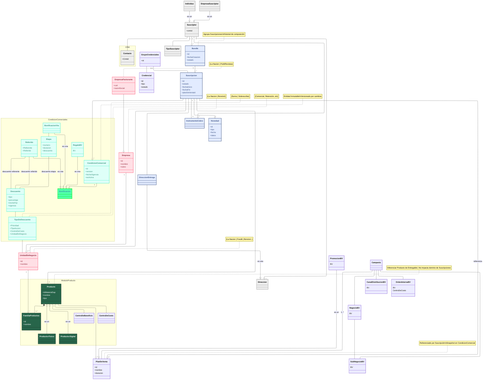

Vamos a trabajar en una reingeniería del módulo de suscripciones. 

Los drivers de la reingeniería son los siguientes:
- Permitir que se creen nuevos negocios que puedan vender diferentes suscripciones y productos (o servicios como acceso digital al diario o a micrositios de diferentes suscripciones como Foodit). Estas suscripciones puden ser gestionadas por diferentes unidades de negocio de diferentes empresas, que facturan por separado. 
- Para Bonvivir (unidad de negocio) otro driver importante es abandonar la plataforma de gestión actual llamada Barrica.
- El sistema desarrollar sea MultiTenant. 
- Diferentes unidades de negocio puedan ofrecer ofertas que permitan combinar suscripciones de la misma o de diferentes unidad de negocio y empresas.

# Especificación Funcional del Dominio de Suscripciones

## 1. Introducción

La Nación es una empresa de medios que ofrece una variedad de productos y servicios a través de suscripciones, tanto físicas como digitales. Hoy en día tiene bajo el paraguas de suscripciones 2 negocios principales, suscripciones de productos despachables(físicos, x ej.:  diario y revistas) y suscripciones de productos digitales que proveen acceso a contenidos en línea. Dentro del espectro de suscripciones digitales se distinguen diferentes unidades de negocio, como LN Digital y Foodit cada uno de estos es un prodicto digital y pertenecen a diferentes familias, ambos accesos digitales facturables por la empresa LN.

Bonvivir es otra unidad de negocio que ofrece suscripciones a productos despachables, gestionados por una empresa separada.

Hoy en día la gestión de suscripciones de La Nación y Bonvivir poseen se realiza a través de plataformas de ventas, gestión de suscripciones y facturación. Estas plataforma presenta limitaciones para adaptarse a nuevos modelos de negocio y unidades de negocio independientes.

Además La Nación y Bonvivir, poseen sus propias unidades de negocio, productos, planes de venta, procesos de facturación y gestión de clientes.

El **dominio funcional del sistema de Suscripciones** tiene como objetivo la gestión integral del ciclo de vida de las suscripciones, de manera agnóstica y desacoplada de los procesos de ventas, facturación, cobranzas y otros sistemas de negocio. Su responsabilidad principal es administrar la relación entre un suscriptor y los productos/servicios a los que accede, gestionando altas, bajas, suspensiones, rehabilitaciones, cambios y el seguimiento de estados, sin involucrarse en la lógica de adquisición o facturación, que son tratadas como sistemas externos.

Nota: En este documento se introduce y usa de forma consistente el concepto de "Bundle" (agrupación de suscripciones vendidas juntas). Ver la sección de definiciones y reglas propias más abajo.

---
### Relación entre Suscripción, Producto, Familia de Productos, Planes de Venta y Campañas

#### 1. Familia de Productos
- **Definición:** Agrupador lógico de productos relacionados. Ejemplo: la familia "La Nación" puede incluir diario impreso, edición digital, revistas, etc.
- **Función:** Organiza productos con características similares y facilita reglas/promociones a nivel grupo.

#### 2. Producto
- **Definición:** Ítem concreto que se vende o suscribe (ejemplo: "Diario La Nación Digital").
- **Relación:** Cada producto pertenece a una única familia de productos.

#### 3. Plan de Venta
- **Definición:** Conjunto de atributos que define lo que se vende y en qué condiciones (producto, bonificaciones, puntos, precio, etc.).
- **Relación:** Un plan de venta está asociado a uno o más productos y define las condiciones de comercialización.

### 4. Suscripción
- **Definición:** Relación activa entre un cliente y un plan de venta. Representa el acuerdo comercial por el cual el cliente accede a productos bajo las condiciones del plan.
- **Relación:** Una suscripción se genera a partir de la venta de un plan de venta.

#### 5. Campaña
- **Definición:** Acción comercial/marketing que agrupa condiciones especiales de venta (descuentos, bonificaciones, productos incluidos, duración, etc.).
- **Relación:** Las campañas definen qué planes de venta están disponibles en un período y bajo qué condiciones promocionales.

---

### Ejemplo de Relación

1. **Familia de Productos:** "Revistas Mensuales"
2. **Productos:** "Revista Living", "Revista Lugares" (ambos dentro de la familia "Revistas Mensuales")
3. **Plan de Venta:** "Plan Anual Revistas" (incluye ambos productos, define precio, periodicidad, puntos, etc.)
4. **Suscripción:** El cliente adquiere el "Plan Anual Revistas", generando una suscripción que le da derecho a recibir ambas revistas mensualmente.
5. **Campaña:** "Promo Verano" ofrece el "Plan Anual Revistas" con un 30% de descuento y acceso a beneficios adicionales durante enero y febrero.

---

### Diagrama de Relaciones (Mermaid)

---

### Resumen

- **Familia de Productos** agrupa **Productos**.
- **Planes de Venta** definen condiciones para vender y facturar uno o varios **Productos**.
- Una **Suscripción** es la relación entre un cliente, un **Producto** y un **Plan de Venta**.
- Las **Campañas** agrupan y promocionan **Planes de Venta** bajo condiciones especiales.

## 2. Alcance Funcional

### 2.1. Funcionalidades Principales

- **Gestión de Suscripciones**: Alta, baja, suspensión, rehabilitación, cambio de producto, cambio de módulo, cambio de instrumento de cobro, vacaciones, etc..

- **Gestión de Bundles**: Creación y mantenimiento de agrupaciones de suscripciones vendidas conjuntamente (un "Bundle" puede contener una sola suscripción). Se debe mantener historial de composición y de cambios a lo largo de la vida del Bundle.

- **Gestión de Estados**: Control y actualización de los estados de las suscripciones (Pendiente, activa, cancelada, suspendida, baja, rechazada, terminada) según eventos internos o externos.

- **Cambios de Productos**: Gestión de cambios de productos asociados a las suscripciones. Si el cambio implica una baja y alta, se deben generar las novedades correspondientes. Si el cambio se realiz a una suscripción dentro de un bundle, se debe registrar el cambio en la composición del bundle. Y este camqbio debe quedar registrado en el historial de composiciones del bundle y generar una nueva versión de condiciones comerciales para todas las suscripciones del boundle. Al cambiar el producto cambia la composición del boundle por lo tanto también las condiciones comerciales, incluso de aquellas suscripciones que no cambiaron de producto.
- **Cambios de Planes de Venta**: Gestión de cambios de planes de venta asociados a las suscripciones. Al cambiar el plan de venta, se debe generar una nueva versión de condiciones comerciales para la suscripción afectada. Si el cambio de plan afecta la composición del bundle se debe registrar el cambio en la composición del bundle y generar una nueva versión de condiciones comerciales para todas las suscripciones del bundle.

- **Gestión de Novedades**: Procesamiento de eventos que afectan el estado de la suscripción.

- **Interfaz de usuario y APIs**: Para operadores, sistemas internos.

- **Configuraciones Específicas**: Parámetros por unidad de negocio, como cantidad de días para baja por falta de pago, suspensiones, etc.
  
- **Motor de Cálculo de Facturación**: Calcula el monto a facturar consultando el precio del producto en el sistema de catálogo 'Sistema externo' y aplicando descuentos y bonificaciones según su Condición Comercial vigente (última versión). Genera las Transacciones de Cobranza a Presentar en SCCR.

- **Versionado de Condiciones Comerciales**: Cada suscripción mantiene una referencia al plan de venta y el historial (versionado) de sus condiciones comerciales como entidades inmutables. La versión más reciente disponible para esa suscripción determina las etapas, descuentos y bonificaciones aplicables en cada momento. Si la composición de un Bundle cambia, las condiciones comerciales asociadas a las suscripciones que lo componen pueden cambiar y deberá registrarse una nueva versión por suscripción. Las condiciones comerciales están definidas originalmente en el **PlanDeVenta** (etapas, descuentos, tipos de descuento, duración, precio, etc.). Al crear una suscripción el sistema debe replicar (snapshot) en la suscripción los detalles comerciales del plan para crear la versión inicial de las condiciones comerciales asociadas a esa suscripción. A partir de entonces, cualquier cambio relevante (por ejemplo: cambio de producto asociado, modificación de descuento, actualización del plan de venta o aplicación de una campaña) debe generar una nueva versión de las condiciones comerciales de la suscripción (descuentos, bonificaciones, tipos de descuento y etapas). La versión más reciente determina las etapas, descuentos y bonificaciones aplicables en cada momento y las versiones previas deben conservarse para auditoría y cálculos históricos.
- **Gestión de Bonificaciones**: Las suscripciones pueden tener bonificaciones asociadas adicionales a las definidas en el **Plan de venta**. Cualquier bonificación otorgada debe incluirse como parte de las condiciones comerciales. Los descuentos por retención son solo un tipo de bonificaciones. El sistema debe permitir la gestión de estas bonificaciones adicionales, incluyendo su aplicación, vigencia y condiciones.

### 2.2. Procesos Internos

- **Registro y actualización de datos de suscripción** (domicilio, instrumento de cobro, grupo, mail, etc.).
- **Procesos batch**: Automatización de suspensiones, bajas, reprocesos de cobranzas, etc.
- **Inbox de gestión**: Visualización y aprobación de lotes de cobranzas a presentar.
- **Control de rechazos y suspensiones**: Registro y procesamiento de rechazos de cobro, suspensión automática y comunicación a contabilidad.

---

## 3. Límites Funcionales (Boundaries)

El sistema de suscripciones **no incluye**:
- **Ventas**: El proceso de adquisición de una suscripción, la gestión de campañas, productos y planes de venta. (estos son responsabilidad de sistemas externos de ventas/checkout).

    Nota: Aunque las ventas se gestionen desde sistemas externos, el dominio de Suscripciones debe recibir del sistema de Ventas la información mínima necesaria para crear el boundle y las suscripciones asociadas, incluyendo la información sobre empresas responsables de facturación, versiones de condiciones comerciales y fechas de vigencia.
- **Facturación y Cobranzas**: Registro de ventas, emisión de facturas, gestión de pagos y deudas. (realizados por sistemas externos como SAP)
- **CRM**: Gestión de datos de clientes y contactos.
- **Presentaciones**: Procesamiento de transacciones de cobranzasy validación de cobros.
- **Gestión de Cobranzas**: Procesos de presentación de débitos y créditos, registro de rechazos, gestión de reciclados y comunicación de resultados a sistemas externos.
- **Logística y Entregas**: Gestión de despachos y distribución de productos físicos.
- **Beneficios y Puntos**: Cálculo y asignación de puntos, beneficios y promociones.
- **Gestión de Credenciales**: Asignación y baja de credenciales asociadas a la suscripción.
- **Eventos Históricos**: Almacenamiento y consulta de eventos históricos de la suscripción.

    Nota: Se mantiene un historial de cambios y versiones dentro del dominio de Suscripciones (eventos y versiones), pero para consultas analíticas o BI muy extensas puede integrarse con sistemas de almacenamiento histórico externos.

---

## 4. Interacción con Sistemas Externos

El sistema de suscripciones interactúa con otros sistemas de negocio, tratándolos como **sistemas externos independientes**:

- **Ventas/Checkout**: El alta de una suscripción puede ser disparada por un proceso de venta externo, que provee los datos necesarios para el registro.
    - El sistema de Ventas debe transmitir: identificación del boundle de venta, la lista inicial de suscripciones que componen el boundle, para cada suscripción: producto(s) asociado(s), plan de venta referenciado (ID), fechas de inicio y fecha final (si aplica), empresa(s) para facturación, y la versión de condiciones comerciales aplicable al momento de la venta.
    - Nota de implementación: el módulo de Suscripciones puede recibir el `planId` y deberá obtener la definición del `PlanDeVenta` (etapas, descuentos, tipos de descuento, precios) desde el catálogo maestro de planes para crear el snapshot de condiciones en la suscripción. Alternativamente, el sistema de Ventas puede enviar el `planSnapshot` ya resuelto; el contrato debe definir cuál de las dos opciones se usará en cada integración.
- **Facturación (SAP)**: Informa cambios de estado (alta, baja, suspensión) para que el sistema de facturación procese los movimientos económicos correspondientes. 

    - La facturación opera por Empresa: un mismo boundle puede contener suscripciones cuya facturación corresponda a empresas diferentes. El dominio de Suscripciones debe mantener la asignación de qué suscripción se factura por qué empresa y notificar a cada sistema de facturación pertinente los eventos de alta/baja/cambio.
- **CRM**: Consulta y actualización de datos de clientes y domicilios de clientes asociadas a un CRMID.
- **Gestor de Cobranzas**: Recibe notificaciones de de cobro exitoso o fallido para actualizar el estado de la suscripción, rehabilitar o suspender. Validación y control de lotes de cobranza antes de la presentación al gateway. No procesa pagos directamente ni gestiona instrumentos de cobro.    
- **Logística**: Informa altas y bajas para la gestión de entregas físicas.
- **Beneficios/Puntos**: Informa cambios de estado para la asignación o retiro de puntos y beneficios.
- **Gestion de Credenciales**: Informa altas y bajas de suscripciones para que el sistema de gestión de credenciales determine el otorgamiento o remoción, cantidad y categoria de credenciales al suscriptor.
    - Cuando se generen cambios de versión en las condiciones comerciales de una suscripción, se debe incluir en la novedad la referencia a la versión aplicada para permitir a sistemas consumidores (credenciales, beneficios) aplicar reglas compatibles.
  

---

# OJO CON LOS CRMIDs DIFERENTES LN Y BV

---

## 6. Modelo de Dominio

---

## 5. Casos de Uso Principales

- **Alta de Suscripción**: Recibe evento de venta, valida reglas internas, crea la suscripción y notifica a sistemas externos.
- **Baja de Suscripción**: Procesa solicitudes internas o externas, actualiza estado y notifica a facturación, logística y beneficios.
- **Suspensión/Rehabilitación**: Procesa eventos de deuda/pago, actualiza estado y notifica a facturación y beneficios.
- **Cambio de Producto/Módulo**: Valida condiciones, realiza bajas/altas asociadas y notifica a sistemas externos 
- **Gestión de Credenciales**: Asigna o retira credenciales según el estado de la suscripción.
- **Procesos Batch**: Automatiza suspensiones, bajas y rehabilitaciones según reglas de negocio y eventos recibidos.

- **Gestión de Boundles y Cambios de Composición**: Operaciones para crear, actualizar, versionar y cerrar boundles. Cuando cambia la composición de un boundle (altas/bajas de suscripciones dentro del mismo), se debe:

  - Registrar el cambio como una operación con firma/autorización (ver sección de seguridad y autorizaciones).
  - Generar novedades por cada suscripción afectada que incluyan la nueva versión de condiciones comerciales cuando corresponda.
  - Mantener historial de composiciones del boundle para auditoría.

- **Versionado de Condiciones por Suscripción**: Casos de uso para aplicar nuevas versiones de condiciones comerciales a una suscripción (por cambio de plan, campaña, composición de boundle o actualización manual autorizada). Cada versión crea un registro histórico y se aplica a partir de la fecha de vigencia indicada.
- **Gestión de Bonificaciones**: Las suscripciones pueden tener bonificaciones asociadas adiconales a las definidas en el **Plan de venta**. El sistema debe permitir la gestión de estas bonificaciones adicionales, incluyendo su aplicación, vigencia y condiciones.
  
---

## 7. Consideraciones de Diseño

- El sistema de Suscripciones **no debe contener lógica de ventas ni de facturación**, solo debe reaccionar a eventos provenientes de estos sistemas y enviando información a través de interfaces desacopladas.

- Los procesos internos deben ser **idempotentes** y tolerantes a fallos en la comunicación con sistemas externos.
- El sistema debe contemplar **MultiEmpresa** y configuraciones específicas por unidad de negocio.
- La seguridad y privacidad de los datos del suscriptor deben ser garantizadas, cumpliendo con normativas vigentes.
- La trazabilidad de todas las acciones y cambios de estado debe ser asegurada mediante logs y auditorías.
- La arquitectura debe ser basada en **microservicios y eventos** permitiendo la incorporación de nuevas funcionalidades y la integración con nuevos sistemas externos sin afectar la operatividad del sistema de suscripciones.
- Los cambios de estado deben ser **atómicos y auditables**.
- Toda interacción con sistemas externos debe ser desacoplada y basada en eventos o APIs bien definidas.
- El sistema debe ser capaz de operar con múltiples tipos de productos, planes y reglas de negocio, sin depender de la lógica de ventas.
- La configuración de parámetros críticos (días para baja, suspensión, etc.) debe ser centralizada y auditable.

- **Autorización y firma de mensajes para cambios críticos**: Sólo actores autorizados (servicios o usuarios con permisos explícitos) pueden modificar la composición de un boundle o forzar cambios de versión en las condiciones comerciales de una suscripción. Reglas mínimas:
  - Todas las solicitudes de modificación crítica deben incluir metadata de autoría, un identificador de transacción y una firma digital o token de autorización verificable.
  - El sistema debe validar la firma/autorización antes de aplicar cambios y registrar la identidad del actor que originó la operación.
  - Las APIs internas o endpoints que permitan ediciones masivas de boundles deben exigir roles administrativos adicionales y pasar por validaciones de coherencia de negocio.

- **Fechas de inicio y fin**: Cada suscripción puede tener fecha de inicio y fecha final (opcional). Estas fechas determinan la vigencia de la suscripción y la aplicación de etapas/descuentos según el plan y su versionado.

- **Venta de Suscripciones, no de Productos**: El contrato comercial vendido al cliente es una suscripción (o un boundle de suscripciones). Los productos son atributos de la suscripción (lo que el suscriptor recibe). Las operaciones internas deben modelar la suscripción como la entidad principal.

- **Facturación por Empresa**: La responsabilidad de facturar es por Empresa. Un mismo boundle puede contener suscripciones de distintas empresas; el sistema debe mantener la asignación por suscripción y notificar a cada sistema de facturación correspondiente las novedades relevantes.

---

## 7. Glosario de Términos

- **Suscripción**: Relación contractual para la provisión periódica de un producto o servicio.
- **Bundle**: Agrupación lógica de una o más suscripciones que se venden juntas como paquete. Durante la vida del Bundle, la composición de sus suscripciones puede cambiar (altas y bajas); todos estos cambios deben ser versionados y auditables. Cada suscripción pertenece a un Bundle.
- **Suspensión**: Interrupción temporal de la suscripción (por falta de pago, vacaciones, etc.).
- **Rehabilitación**: Reactivación de una suscripción suspendida.
- **Baja**: Cancelación definitiva de la suscripción.
- **Instrumento de Cobro**: Medio de pago asociado a la suscripción (tarjeta, débito, etc.).
- **Gateway de Pago**: Sistema externo encargado de procesar los cobros.
- **SAP**: Sistema externo de facturación y contabilidad.
- **CRM**: Sistema externo de gestión de clientes y contactos.
- **Credencial**: Permiso o acceso asociado a una suscripción.
- **Estado de Suscripción**: Situación actual (activa, suspendida, baja, etc.).
- **Sistema Externo**: Cualquier sistema fuera del dominio de suscripciones (ventas, facturación, CRM, logística, beneficios, etc.)
- **Novedad**: Evento que afecta el estado de una suscripción.
 - **Versionado de Condiciones Comerciales**: Mecanismo por el cual cada suscripción mantiene un historial de las condiciones comerciales aplicadas (plan de venta referenciado, etapas, descuentos, vigencias). La versión actual determina precios/etapas vigentes; versiones anteriores deben conservarse para auditoría y cálculo retroactivo si corresponde.
  - **Características clave de una Novedad**:
    - Cada novedad corresponde a un tipo de movimiento específico (por ejemplo: alta de suscripción, suspensión por falta de pago, baja, rehabilitación, cambio de domicilio, etc.).
    - Incluye información detallada sobre el evento: tipo de movimiento, datos del suscriptor, fechas relevantes, y otros campos asociados al cambio.
    - Sirve como mecanismo de comunicación entre el sistema de suscripciones y otros sistemas (por ejemplo, logística, facturación, distribución), permitiendo que estos sistemas externos se mantengan sincronizados con los cambios en las suscripciones.
    - Las novedades pueden ser generadas tanto por acciones del usuario (por ejemplo, solicitud de cambio de domicilio) como por procesos automáticos (por ejemplo, suspensión por falta de pago).
  - **Ejemplos de novedades**:
    - Alta de suscripción
    - Suspensión de suscripción (por falta de pago o vacaciones)
    - Baja de suscripción
    - Rehabilitación de suscripción
    - Cambio de domicilio
    - Modificación de grupo o mail
    - Cambio de forma de pago
---

## 8. Resumen

El sistema de suscripciones es responsable de la **gestión integral del ciclo de vida de las suscripciones**, manteniendo su independencia funcional respecto a ventas, facturación, CRM y pagos. Su boundary se define por la gestión de la suscripción en sí misma, interactuando con sistemas externos solo a través de interfaces bien definidas y desacopladas.

---

## 9. Puntos Pendientes / Preguntas Abiertas
- Definir interface de Usuario, ¿como interactuará por ejemplo con Reclamos? Si movemos el módulo de suscripciones a un sistema independiente, ¿cómo se gestionan las consultas y reclamos de los usuarios? ¿x Nuevo Club? sí es así el cambio no es menor ya que no consultaría más la base de datos de suscripciones directamente. ¿Se manejará desde la nueva plataforma? sí es así habría que definir la integración x que debería usar servicios de nuevo club para gestionar los reclamos. 

- Entender la realción de suscripciones con Retenciones y promociones. ¿Cómo impactan las promociones y retenciones en la gestión de suscripciones? ¿Se deben considerar estos aspectos dentro del dominio de suscripciones o seguirán siendo gestionados por sistemas externos?

  
---