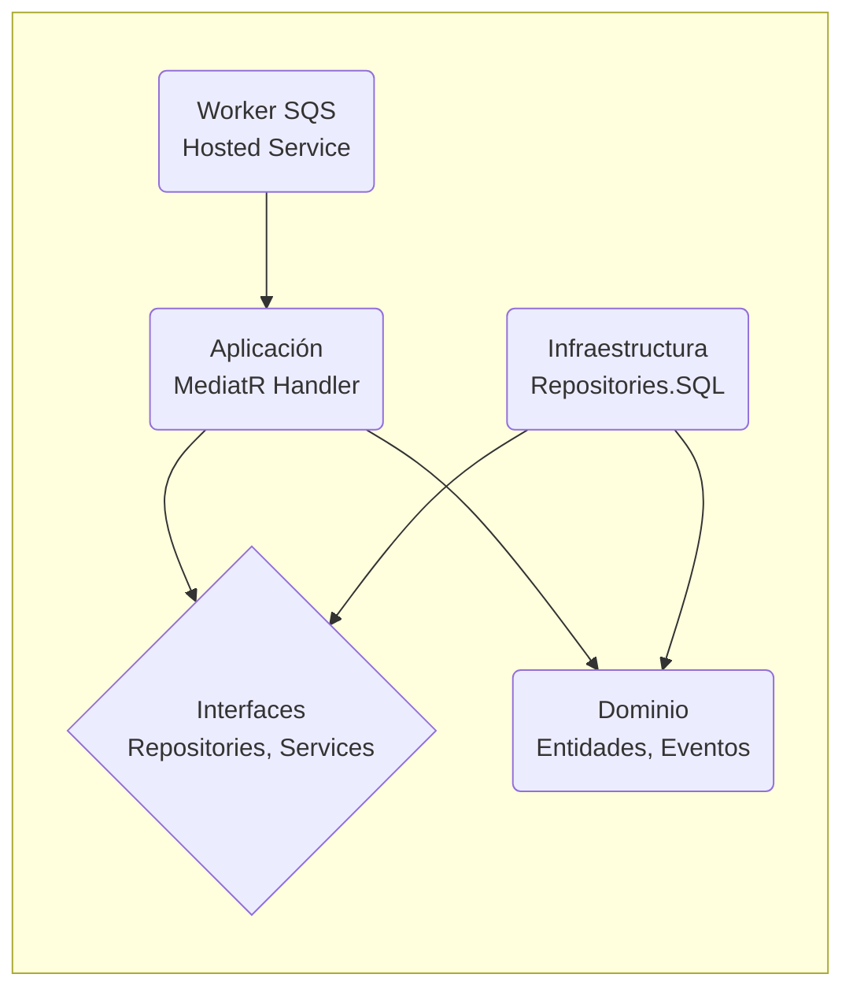

# Arquitectura de Solución: LaNacion.Core.Templates.SqsRdr

**Introducción:** Esta plantilla es una base para el desarrollo de workers de procesamiento de colas SQS en La Nación. Su diseño está basado en principios de Arquitectura Limpia (Clean Architecture) y se apalanca en librerías de infraestructura internas para garantizar la consistencia, mantenibilidad y escalabilidad de las soluciones que se construyan a partir de ella.

## 1. Visión General y Estilos Arquitectónicos

### 1.1. Paradigma Arquitectónico
La solución implementa una **Arquitectura Limpia (Clean Architecture)** como pilar fundamental, garantizando la separación de concerns y la independencia de la lógica de negocio respecto a la infraestructura (en este caso, el servicio de SQS y la base de datos). Sobre esta base, se aplican los siguientes estilos y patrones:

-   **Arquitectura Orientada a Eventos (Event-Driven)**: El propósito central de la solución es consumir y procesar eventos de forma asíncrona desde una cola SQS, lo que la convierte en un componente nativo de una arquitectura orientada a eventos.
-   **Monolito Modular**: Aunque se despliega como un único servicio (worker), la solución está estructurada en módulos cohesivos y débilmente acoplados (Dominio, Aplicación, Infraestructura), diseñada para operar como un microservicio especializado en un ecosistema más grande.
-   **CQRS (Command Query Responsibility Segregation)**: Si bien este worker se enfoca en el lado del "Command" (procesar un evento que modifica el estado del sistema), el uso de MediatR para manejar el mensaje encapsula la lógica en un `Handler`, adhiriéndose a los principios de CQRS.

### 1.2. Justificación de Elecciones
-   **Clean Architecture**: Se eligió para aislar el dominio y la lógica de aplicación de detalles externos como la base de datos y el mecanismo de recepción de mensajes (SQS). Esto aumenta la testeabilidad y la mantenibilidad.
-   **CQRS y MediatR**: Permiten gestionar la complejidad de los casos de uso, desacoplando a los emisores de las solicitudes de sus manejadores y optimizando los flujos de datos de lectura y escritura.
-   **Hosted Services de .NET**: El uso de `IHostedService` es el patrón estándar de .NET para ejecutar tareas de larga duración en segundo plano, ideal para un listener de SQS.
-   **Event-Driven**: Es clave para la resiliencia y escalabilidad del ecosistema. Permite el procesamiento desacoplado y asíncrono, asegurando que los sistemas puedan operar de forma independiente.

## 2. Diseño de Capas y Flujo de Datos

### 2.1. Diagrama de Capas y Dependencias
El flujo de dependencias sigue estrictamente la Regla de Dependencia de la Arquitectura Limpia: las capas externas dependen de las internas.

### 2.2. Descripción de Capas (Proyectos)

#### **LaNacion.Core.Templates.SqsRdr (Capa de Infraestructura y Host)**
-   **Responsabilidad**: Punto de entrada de la aplicación. Configura y ejecuta el worker como un `IHostedService`. Configura el contenedor de inyección de dependencias (DI) y la infraestructura de logging, configuración y conexión a AWS.
-   **Componentes Clave**:
    -   `Program.cs`: Orquesta el arranque, registrando servicios como Serilog, MediatR y los servicios del worker.
    -   `Workers/ConfigureServicesExtensions.cs`: Contiene la lógica de extensión para registrar el `SqsQueueConsumerService<T>`, que es el listener genérico de SQS, y lo asocia a una clase de evento (`Customer_Added`) y a un nombre de cola física ('customer-created').

#### **LaNacion.Core.Templates.SqsRdr.Application (Capa de Aplicación)**
-   **Responsabilidad**: Contiene la lógica de los casos de uso. Orquesta al dominio y a la infraestructura para ejecutar el procesamiento del evento recibido.
-   **Componentes Clave**:
    -   `MessageProcessor.cs`: Handler de MediatR que se activa cuando el worker recibe un mensaje del tipo `Customer_Added`. Implementa la lógica de negocio principal, como validaciones de idempotencia y orquestación de la persistencia.

#### **LaNacion.Core.Templates.SqsRdr.Application.Interfaces (Abstracciones de Infraestructura)**
-   **Responsabilidad**: Define los contratos (interfaces) que la infraestructura debe implementar. Ej: `ICustomerRepository`, `IMensajesRecibidos`. Esto permite la inversión de dependencias.

#### **LaNacion.Core.Templates.SqsRdr.Domain (Capa de Dominio)**
-   **Responsabilidad**: Contiene las entidades de negocio (`Customer`, `Address`) y la lógica de dominio más pura. Son agnósticas a la persistencia.

#### **LaNacion.Core.Templates.SqsRdr.Domain.Events (Eventos de Dominio)**
-   **Responsabilidad**: Define las clases que representan los eventos que se comunican a través de las colas, como `Customer_Added` y `Customer_Sincronized`.

#### **LaNacion.Core.Templates.SqsRdr.Repositories.SQL (Capa de Infraestructura - Datos)**
-   **Responsabilidad**: Implementación concreta de los repositorios para la persistencia de datos relacionales, utilizando **Dapper**.

### 2.3. Flujo de Datos Extremo a Extremo
1.  El `SqsQueueConsumerService` (un `IHostedService`) está escuchando constantemente la cola SQS 'customer-created'.
2.  Cuando llega un mensaje, el servicio lo lee y lo deserializa en un objeto `Customer_Added`.
3.  El servicio utiliza MediatR para "publicar" el evento `Customer_Added` dentro de la aplicación.
4.  El `MessageProcessor` (handler de MediatR) recibe el evento.
5.  El handler realiza una comprobación de idempotencia contra la tabla `MensajesRecibidos` para evitar procesar duplicados.
6.  Si el mensaje es nuevo, utiliza el `CustomerRepository` para persistir la nueva entidad `Customer` en la base de datos.
7.  Dentro de la misma transacción de base de datos (Unit of Work), publica un nuevo evento `Customer_Sincronized` utilizando el patrón Outbox, garantizando la consistencia.
8.  Finalmente, el `SqsQueueConsumerService` elimina el mensaje original de la cola SQS.

## 3. Patrones de Diseño y Arquitectónicos

| Patrón | Implementación y Justificación |
| :--- | :--- |
| **Dependency Injection (DI)** | Utilizado de forma nativa por .NET 6. En `Program.cs` y `ConfigureServicesExtensions.cs` se registran las dependencias, lo que desacopla los componentes. |
| **Hosted Service** | Se usa `IHostedService` para implementar el listener de SQS como un servicio de fondo gestionado por el host de .NET. |
| **Repository** | Abstrae la lógica de acceso a datos (`CustomerRepository`). Permite cambiar la estrategia de persistencia sin impactar la capa de aplicación. |
| **Unit of Work** | Gestionado a través de la librería `LaNacion.Core.Infraestructure.Data.Relational`. Agrupa múltiples operaciones de repositorio en una única transacción para garantizar la atomicidad. |
| **Mediator (MediatR)** | Desacopla la recepción del mensaje de su procesamiento. El `SqsQueueConsumerService` no conoce al `MessageProcessor`; solo publica un evento que MediatR se encarga de enrutar al handler correcto. |
| **Outbox Pattern** | El `MessageProcessor` guarda el evento de salida (`Customer_Sincronized`) en la misma transacción que la entidad de negocio. Un proceso separado (no visible en este código, parte de la infraestructura) se encarga de publicar este evento, garantizando que no se publiquen eventos si la transacción falla. |
| **Options Pattern** | La configuración de SQS (`AWSSQSConnectionSettings`) se carga desde `appsettings.json` y se inyecta como `IOptions<T>`, permitiendo un acceso fuertemente tipado a la configuración. |

## 4. Stack Tecnológico

### 4.1. Frameworks y Librerías Clave
-   **Runtime**: .NET 6
-   **Framework de Host**: Microsoft.Extensions.Hosting
-   **Mediación**: MediatR
-   **Acceso a Datos**: Dapper (abstraído a través de `LaNacion.Core.Infraestructure.Data.Relational`)
-   **Validación**: FluentValidation
-   **Mapeo**: AutoMapper
-   **Logging**: Serilog
-   **Integración Legacy**: System.ServiceModel (Cliente WCF)

### 4.2. Ecosistema de Librerías Internas `LaNacion.Core.Infraestructure`
El worker depende de un conjunto de librerías internas que estandarizan la infraestructura:
-   `LaNacion.Core.Infraestructure.Data.*`: Proporcionan una capa de abstracción sobre Dapper y la gestión de conexiones transaccionales (Unit of Work) para **MySQL**.
-   `LaNacion.Core.Infraestructure.Events.Suscriber`: Provee la clase genérica `SqsQueueConsumerService<T>` que encapsula toda la lógica de bajo nivel para conectarse, recibir y eliminar mensajes de SQS.
-   `LaNacion.Core.Infraestructure.MediatR.Extensions`: Provee comportamientos (`behaviors`) reusables para el pipeline de MediatR.
-   `LaNacion.Core.Infraestructure.Serilog.Extensions`: Centraliza la configuración de logging para enviar trazas a AWS CloudWatch.

### 4.3. Bases de Datos y Servicios Cloud
-   **Bases de Datos**: Soporte para **SQL Server, PostgreSQL, y MySQL**, configurable por ambiente.
-   **Cloud Provider**: **AWS**.
    -   **Mensajería**: **AWS SQS** para la recepción de eventos.
    -   **Observabilidad**: Datadog para la centralización de logs.
    -   **Contenedores**: La solución está diseñada para ser empaquetada en un contenedor Docker y desplegada en **AWS ECS (Elastic Container Service)**.
-   **Infraestructura como Código (IaC)**: El proyecto utiliza el **AWS CDK (Cloud Development Kit)** con TypeScript para definir y versionar la infraestructura en la nube (roles, colas SQS, servicios ECS, etc.).
-   **CI/CD**: Se utiliza **Azure DevOps** con `azure-pipelines.yml` para la integración y despliegue continuo.

---

