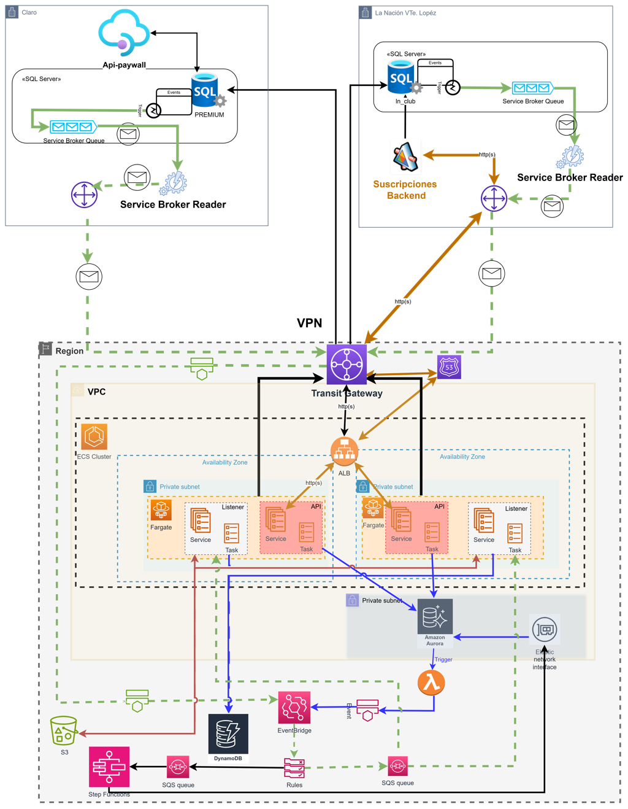

# Arquitectura base tribu Suscripciones 

### Contexto y Visión

La presente arquitectura responde a la necesidad de evolucionar el ecosistema tecnológico de la Tribu Suscripciones hacia un modelo híbrido que permita aprovechar las capacidades de elasticidad, escalabilidad y servicios gestionados de AWS, manteniendo la interoperabilidad con los sistemas legacy desplegados en los datacenters de Vicente López y Claro. La estrategia arquitectónica adoptada se fundamenta en tres pilares fundamentales: arquitectura de microservicios para la descomposición funcional, Event-Driven Architecture (EDA) para la integración asíncrona, y el patrón Transactional Outbox para garantizar consistencia eventual. Esta combinación de patrones establece un ecosistema distribuido, resiliente y altamente escalable.

### Diseño de Integración y Comunicación Asíncrona

El núcleo de la integración se materializa a través de **Amazon EventBridge**, que actúa como _event bus empresarial_, proporcionando un **punto de desacoplamiento** crítico entre los sistemas on-premise y los servicios cloud-native. Los sistemas legacy publican **eventos de dominio** que representan **cambios de estado significativos en el negocio**, los cuales son capturados y propagados hacia la nube mediante un mecanismo de publicación confiable basado en el patrón Transactional Outbox.  
EventBridge implementa un modelo de **enrutamiento basado en reglas** declarativas que evalúan los atributos de los eventos entrantes, específicamente el nombre del evento especificado en el atributo `detail-type`, para determinar el destino apropiado. Esta arquitectura de enrutamiento permite una topología flexible donde **cada tipo de evento puede ser dirigido a una o múltiples colas SQS**, facilitando el **procesamiento paralelo y la segregación de responsabilidades** entre diferentes consumidores. Cada cola SQS tiene siempre invariablemente una Dead Letter Queue asociada.

### Implementación del Patrón Transactional Outbox

La garantía de consistencia eventual entre el estado transaccional de las bases de datos y la publicación de eventos se logra mediante la implementación rigurosa del patrón Transactional Outbox, adaptado a las características específicas de cada plataforma de datos.  

En el entorno on-premise, SQL Server Service Broker proporciona las primitivas necesarias para implementar un sistema de mensajería transaccional integrado con el motor de base de datos. La tabla `Events` actúa como outbox transaccional, donde cada inserción de registro ocurre dentro del mismo contexto transaccional ACID que las operaciones de negocio. Un trigger de base de datos captura estas inserciones y publica mensajes en una cola interna de Service Broker, garantizando la atomicidad entre la persistencia del evento y su encolamiento. Un Background Service implementado en .NET 6.0, ejecutándose como hosted service, consume estos mensajes de manera confiable y los propaga hacia EventBridge, actualizando el estado del evento solo tras la confirmación exitosa de la publicación.  

En el ecosistema AWS, Aurora Serverless MySQL ofrece la capacidad nativa de invocar funciones Lambda desde triggers de base de datos mediante el mecanismo de invocación síncrona. Esta característica permite implementar el patrón Outbox de manera serverless: cuando un registro es insertado en la tabla `Events` dentro de una transacción de negocio, un trigger de base de datos invoca una función Lambda implementada en Node.js que publica el evento en EventBridge. La arquitectura incluye una regla genérica en EventBridge que, basándose en el atributo `detail-type` del evento, invoca la función Lambda correspondiente al módulo de origen para actualizar el estado del evento a "publicado", cerrando así el ciclo de vida del patrón Outbox y proporcionando trazabilidad completa del proceso de publicación.

**Nota**: El enrutamiento de eventos en EventBridge utiliza el patrón `"detail-type": ["VentasAlta", "CobranzasResultado", "FacturacionCambio"]` para clasificar y dirigir eventos a sus colas SQS correspondientes.

### Arquitectura de Microservicios y Procesamiento en AWS

La arquitectura implementa un modelo de **microservicios** donde cada capacidad de negocio se encapsula en un servicio independiente, desplegado como contenedor en **Amazon ECS con Fargate** como motor de ejecución **serverless**. Esta aproximación elimina la gestión de infraestructura subyacente mientras proporciona aislamiento completo entre servicios, permitiendo evolución tecnológica, despliegue y escalado independientes.  

Cada microservicio se materializa en una de dos modalidades arquitectónicas: **Web APIs que exponen interfaces HTTP/REST para comunicación síncrona request-response**, y **Event Listeners que implementan el patrón de consumidor de eventos para procesamiento asíncrono**. Las Web APIs constituyen microservicios orientados a consultas y comandos síncronos, exponiendo contratos bien definidos mediante OpenAPI/Swagger. Los Event Listeners representan microservicios reactivos que suscriben a eventos específicos del dominio, procesando mensajes de colas SQS dedicadas y ejecutando lógica de negocio de manera autónoma.  

Cada microservicio posee su propio ciclo de vida de despliegue, versionado independiente, y puede escalar horizontalmente según sus propias métricas de demanda. Esta granularidad permite optimizar recursos, donde microservicios con alta carga pueden escalar agresivamente mientras servicios de baja demanda mantienen footprint mínimo. La **implementación** homogénea en .NET Core proporciona consistencia en patrones de desarrollo, observabilidad y gestión operacional, reduciendo la complejidad cognitiva del equipo.  

El modelo de procesamiento asíncrono implementa el patrón **Competing Consumers**, donde múltiples instancias del mismo microservicio Event Listener pueden procesar mensajes de la misma cola en paralelo, **proporcionando throughput escalable y tolerancia a fallos**. Los mensajes que no pueden ser procesados exitosamente tras múltiples reintentos son automáticamente redirigidos a **Dead Letter Queues individuales por microservicio, permitiendo análisis post-mortem, debugging y reprocesamiento manual sin bloquear el flujo principal de procesamiento.**

### Topología de Red y Exposición de Servicios

La arquitectura de red implementa una estrategia de defensa en profundidad con múltiples capas de aislamiento. El **cluster ECS se despliega** exclusivamente **en subnets privadas sin acceso directo a internet**, estableciendo un perímetro de seguridad que previene exposición no autorizada de servicios. La **comunicación con los sistemas on-premise se establece mediante una conexión VPN site-to-site que extiende la red corporativa hacia la VPC de AWS, permitiendo conectividad privada y cifrada.**  

La exposición de servicios hacia diferentes audiencias se gestiona mediante tres Application Load Balancers que implementan políticas de acceso diferenciadas. **El ALB privado, accesible únicamente desde la red corporativa a través de la VPN**, sirve peticiones de sistemas internos. El **ALB semi-público expone servicios a internet pero implementa Security Groups con whitelisting estricto de rangos IP corporativos de La Nación y 
partners autorizados como Wondersoft**. El **ALB público proporciona acceso sin restricciones de IP para servicios de cara al usuario final, específicamente las funcionalidades de checkout y My Account del portal** `http://lanacion.com.ar/`**.**  

El **enrutamiento de peticiones en los ALBs se basa en Host-Header routing**, donde el header HTTP `Host` determina el Target Group de destino, permitiendo multiplexar múltiples servicios a través de un único punto de entrada y simplificando la gestión de certificados SSL/TLS.

### Integración Bidireccional y Llamadas Síncronas

Si bien la **arquitectura privilegia la comunicación asíncrona basada en eventos** para el flujo on-premise hacia AWS, existen escenarios que requieren interacción síncrona en dirección inversa. Los servicios desplegados en AWS **pueden invocar servicios SOAP legacy, Web APIs REST en los datacenters, y ejecutar consultas directas contra bases de datos SQL Server on-premise**. Estas interacciones síncronas se realizan **a través de la VPN**, aprovechando la resolución de nombres **DNS privada y el enrutamiento de red establecido**.

### Servicios de Datos y Almacenamiento

La arquitectura incorpora múltiples servicios de almacenamiento especializados según las características de los datos y patrones de acceso. **Aurora Serverless MySQL** proporciona capacidades relacionales con escalado automático basado en demanda, eliminando el aprovisionamiento de capacidad y optimizando costos en escenarios de carga variable. **DynamoDB** complementa la capa de persistencia para casos de uso que requieren latencias de milisegundos y escalabilidad masiva con modelo de datos clave-valor o documento.  

**Amazon S3** actúa como data lake para intercambio de archivos, principalmente en formato CSV, entre diferentes sistemas y como repositorio de objetos de larga duración. **La integración con DynamoDB Streams permite implementar patrones de Change Data Capture (CDC), donde las modificaciones en tablas DynamoDB disparan funciones Lambda que pueden propagar cambios, materializar vistas, o iniciar procesos de negocio complejos**.

### Orquestación de Procesos Complejos

**Para flujos de negocio que requieren coordinación de múltiples pasos con lógica condicional, manejo de errores sofisticado y compensaciones, la arquitectura incorpora AWS Step Functions**. Este servicio de orquestación serverless permite definir máquinas de estado mediante Amazon States Language (ASL), coordinando la ejecución de funciones Lambda, tareas ECS, y llamadas a servicios AWS. El caso de uso específico de manejo de deudas, que involucra múltiples validaciones, cálculos, integraciones con sistemas de pago y notificaciones, se implementa como una state machine que garantiza consistencia y trazabilidad del proceso end-to-end.

### Consideraciones de Resiliencia y Observabilidad

La arquitectura implementa múltiples mecanismos de resiliencia: Dead Letter Queues para mensajes no procesables, reintentos automáticos con backoff exponencial en las colas SQS, health checks en los Target Groups de los ALBs, y auto-scaling de contenedores ECS basado en métricas de utilización. La observabilidad se construye sobre Datadog para métricas, logs y alarmas, proporcionando visibilidad operacional del sistema distribuido y facilitando la detección proactiva de anomalías.