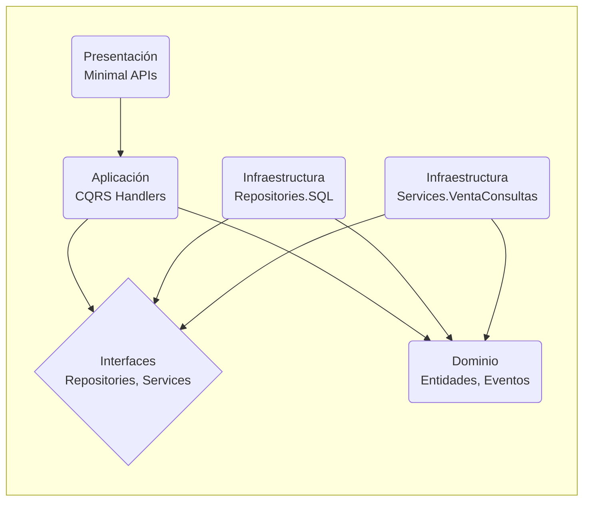

# Arquitectura de Solución: LaNacion.Core.Templates.Web.Api.Minimal

**Introducción:** Esta plantilla es una base para el desarrollo de APIs en La Nación para sus equipos de desarrollo en .Net. Su diseño está basado en principios de Arquitectura Limpia y CQRS, y su apalancamiento en librerías de infraestructura internas, garantiza la consistencia, mantenibilidad y escalabilidad de las soluciones que se construyan a partir de ella.

## 1. Visión General y Estilos Arquitectónicos

### 1.1. Paradigma Arquitectónico
La solución implementa una **Arquitectura Limpia (Clean Architecture)** como pilar fundamental, garantizando la separación de concerns y la independencia de la lógica de negocio respecto a la infraestructura. Sobre esta base, se aplican los siguientes estilos y patrones:

-   **CQRS (Command Query Responsibility Segregation)**: Se segregan las operaciones de escritura (Commands) y lectura (Queries) para optimizar y escalar cada una de forma independiente.
-   **Arquitectura Orientada a Eventos (Event-Driven)**: A través de la publicación de eventos de dominio, se habilita el desacoplamiento entre servicios y la ejecución de lógica de negocio asíncrona.
-   **Monolito Modular**: Aunque se despliega como un único servicio, la solución está estructurada en módulos cohesivos y débilmente acoplados (Dominio, Aplicación, Infraestructura), y su intensión es formar parte de un ecosistema de microservicios a microservicios.

### 1.2. Justificación de Elecciones
-   **Clean Architecture**: Se eligió para aislar el dominio y la lógica de aplicación de detalles externos como la base de datos, el framework de UI y los servicios externos. Esto aumenta la testeabilidad y la mantenibilidad.
-   **CQRS y MediatR**: Permiten gestionar la complejidad de los casos de uso, desacoplando a los emisores de las solicitudes de sus manejadores y optimizando los flujos de datos de lectura y escritura.
-   **Event-Driven**: Es clave para la resiliencia y escalabilidad. Permite que los procesos de negocio no se interrumpan por la indisponibilidad de sistemas secundarios y facilita la comunicación asíncrona en un ecosistema de microservicios.

## 2. Diseño de Capas y Flujo de Datos

### 2.1. Diagrama de Capas y Dependencias
El flujo de dependencias sigue estrictamente la Regla de Dependencia de la Arquitectura Limpia: las capas externas dependen de las internas.



### 2.2. Descripción de Capas (Proyectos)

#### **LaNacion.Core.Templates.Web.Api.Minimal (Capa de Presentación)**
-   **Responsabilidad**: Punto de entrada de la aplicación. Expone los endpoints HTTP utilizando **Minimal APIs de .NET 6**. Configura el contenedor de inyección de dependencias (DI) y el pipeline de middleware.
-   **Componentes Clave**:
    -   `Program.cs`: Orquesta el arranque, registrando servicios como Swagger, autenticación, CORS, logging y Health Checks.
    -   `EndpointDefinitions`: Agrupa las definiciones de endpoints por funcionalidad (ej: `Customer/Endpoints.cs`), promoviendo la modularidad.

#### **LaNacion.Core.Templates.Web.Api.Minimal.Application (Capa de Aplicación)**
-   **Responsabilidad**: Contiene la lógica de los casos de uso. Orquesta al dominio y a la infraestructura para ejecutar las operaciones de negocio. Es el corazón de la lógica de la aplicación.
-   **Estructura**: Organizada por *feature*, donde cada una contiene sus `Commands`, `Queries`, `Handlers` y `Validators` (ej: `Application/Customer/Commands/CreateCustomer`).
-   **Flujo de Datos Típico (Command)**: `Endpoint -> MediatR.Send(Command) -> Handler -> [Validación] -> Repositorio.SaveChanges() -> Publisher.Publish(Event)`.

#### **LaNacion.Core.Templates.Web.Api.Minimal.Application.Interfaces (Abstracciones de Infraestructura)**
-   **Responsabilidad**: Define los contratos (interfaces) que la infraestructura debe implementar. Ej: `ICustomerRepository`, `IVentaConsultas`. Esto permite la inversión de dependencias.

#### **LaNacion.Core.Templates.Web.Api.Minimal.Domain (Capa de Dominio)**
-   **Responsabilidad**: Contiene las entidades de negocio (`Customer`, `Address`) y la lógica de dominio más pura. Estas clases son agnósticas a la persistencia y a cualquier detalle de infraestructura.

#### **LaNacion.Core.Templates.Web.Api.Minimal.Domain.Events (Eventos de Dominio)**
-   **Responsabilidad**: Define los eventos que ocurren en el dominio (ej: `Customer_Created`). Son la base para la arquitectura orientada a eventos.

#### **LaNacion.Core.Templates.Web.Api.Minimal.Repositories.SQL (Capa de Infraestructura - Datos)**
-   **Responsabilidad**: Implementación concreta de los repositorios para la persistencia de datos relacionales, utilizando **Dapper**.

#### **LaNacion.Core.Templates.Web.Api.Minimal.Services.VentaConsultas (Capa de Infraestructura - Servicios)**
-   **Responsabilidad**: Implementación de clientes para servicios externos. En este caso, un cliente **WCF (SOAP)** para interactuar con sistemas legacy.

### 2.3. Mecanismos Transversales (Cross-Cutting Concerns)

-   **Seguridad**: Gestionada a través de un middleware de autenticación JWT y políticas de autorización. La validación se abstrae en la librería `LaNacion.Core.Infraestructure.JWT.Validation.Extensions`.
-   **Observabilidad**:
    -   **Logging**: Se utiliza **Serilog** configurado para enviar logs estructurados a AWS CloudWatch.
    -   **Health Checks**: Se expone un endpoint `/health` que verifica la conectividad con bases de datos y otros servicios críticos.
-   **Manejo de Excepciones**: Un middleware global (`ExceptionHandlingMiddleware`) captura todas las excepciones no controladas, las registra y devuelve una respuesta HTTP estandarizada, evitando la fuga de detalles de implementación.
-   **Patrón Outbox**: Implementado mediante `LaNacion.Core.Infraestructure.Events.Publisher.MessagePublisher` para garantizar la consistencia transaccional entre cambios de estado y publicación de eventos. Los eventos se almacenan en la misma transacción que los cambios de datos y son procesados asincrónicamente por `OutboxProcessor`.

## 3. Patrones de Diseño y Arquitectónicos

| Patrón | Implementación y Justificación |
| :--- | :--- |
| **Dependency Injection (DI)** | Utilizado de forma nativa por .NET 6. En `Program.cs` se registran las dependencias, lo que desacopla los componentes y facilita las pruebas. |
| **Repository** | Abstrae la lógica de acceso a datos (`CustomerRepository`). Permite cambiar la estrategia de persistencia sin impactar la capa de aplicación. |
| **Unit of Work** | Gestionado a través de la interfaz `IContext` y el `BaseRepository`. Agrupa múltiples operaciones de repositorio en una única transacción de base de datos para garantizar la atomicidad. |
| **Mediator (MediatR)** | Desacopla los endpoints de la lógica de negocio. Cada caso de uso es un `Handler` que responde a un `Command` o `Query`, simplificando el flujo de control. |
| **Middleware Pipeline** | El pipeline de ASP.NET Core se usa para procesar las peticiones HTTP. Se insertan middlewares para manejo de excepciones, autenticación y logging. |
| **DTO (Data Transfer Object)** | Aunque no se ve explícitamente en directorios `DTO`, los `Commands` y `Queries` actúan como DTOs, transportando datos entre la capa de presentación y la de aplicación. |
| **Mapper (AutoMapper)** | Se utiliza para convertir entidades de dominio a DTOs o respuestas de API, y viceversa. La configuración se centraliza en `AutomapperProfile.cs`. |
| **Adapter (Wrapper)** | El proyecto `Services.VentaConsultas` actúa como un adaptador que convierte la interfaz de un servicio WCF legacy a una interfaz moderna (`IVentaConsultas`) consumible por la aplicación. |
| **Outbox Pattern** | Implementado en `LaNacion.Core.Infraestructure.Events.Publisher.MessagePublisher` y configurado mediante `AddMessagesOutBox` dentro de `EndPointDefinition.AddCustomerServices`. Los eventos de dominio se guardan en la misma transacción que las entidades de negocio usando `TransactionalOutboxMessagePublisher`. Un proceso separado (`OutboxProcessor`) los lee y publica, garantizando la consistencia entre el estado de la base de datos y los eventos publicados. |

### 3.1. Implementación del Patrón Outbox

El patrón Outbox está implementado para garantizar la consistencia transaccional entre los cambios de estado del dominio y la publicación de eventos:

#### Componentes Clave:
- **`MessagePublisher`**: Implementación base en `LaNacion.Core.Infraestructure.Events.Publisher`
- **`TransactionalOutboxMessagePublisher`**: Decorator que intercepta la publicación de eventos y los almacena en la tabla Outbox
- **`OutboxProcessor`**: Servicio en background que procesa los mensajes pendientes de la tabla Outbox
- **`IOutboxMessageRepository`**: Repositorio para gestionar los mensajes en la tabla Outbox

#### Flujo de Funcionamiento:
1. **Escritura Transaccional**: Cuando se ejecuta un comando que modifica el estado del dominio, el `TransactionalOutboxMessagePublisher` almacena los eventos en la tabla `OutboxMessage` dentro de la misma transacción.
2. **Procesamiento Asíncrono**: El `OutboxProcessor` ejecuta periódicamente y procesa los mensajes pendientes, publicándolos a los sistemas externos (EventBridge, SNS, etc.).
3. **Garantía de Consistencia**: Si la transacción falla, los eventos no se almacenan. Si la publicación falla, los eventos permanecen en la tabla para reintento.

#### Configuración:
```csharp
// En EndPointDefinition.AddCustomerServices
services.AddMessagesOutBox(configuration);

// En Program.cs
builder.Services.AddScoped<IOutboxMessageRepository, OutboxMessageRepository>();
builder.Services.AddHostedService<OutboxProcessor>();
```

## 4. Stack Tecnológico

### 4.1. Frameworks y Librerías Clave
-   **Runtime**: .NET 6
-   **Framework Web**: ASP.NET Core 6 Minimal APIs
-   **Mediación**: MediatR
-   **Acceso a Datos**: Dapper (abstraído a través de `LaNacion.Core.Infraestructure.Data.Relational`)
-   **Validación**: FluentValidation
-   **Mapeo**: AutoMapper
-   **Logging**: Serilog
-   **Integración Legacy**: System.ServiceModel (Cliente WCF)

### 4.2. Ecosistema de Librerías Internas `LaNacion.Core.Infraestructure`
Un aspecto clave de la arquitectura es el uso de un conjunto de librerías internas que estandarizan la infraestructura:
-   `LaNacion.Core.Infraestructure.Data.*`: Proporcionan una capa de abstracción sobre Dapper y la gestión de conexiones para **SQL Server, PostgreSQL y MySQL**.
-   `LaNacion.Core.Infraestructure.Events.*`: Abstraen la publicación de eventos a **AWS EventBridge/SNS**.
-   `LaNacion.Core.Infraestructure.JWT.Validation.Extensions`: Centraliza la lógica de validación de tokens JWT.
-   `LaNacion.Core.Infraestructure.MediatR.Extensions`: Provee comportamientos (`behaviors`) reusables para el pipeline de MediatR, como logging y validación.

### 4.3. Bases de Datos y Servicios Cloud
-   **Bases de Datos**: Soporte para **SQL Server, PostgreSQL, y MySQL**, configurable por ambiente.
-   **Cloud Provider**: **AWS**.
    -   **Mensajería**: AWS SNS y AWS EventBridge para la comunicación entre servicios.
    -   **Observabilidad**: Datadog para la centralización de logs.
    -   **Contenedores**: La solución está diseñada para ser empaquetada en un contenedor Docker y desplegada en **AWS ECS (Elastic Container Service)**.
-   **Infraestructura como Código (IaC)**: El proyecto utiliza el **AWS CDK (Cloud Development Kit)** con TypeScript para definir y versionar la infraestructura en la nube (roles, servicios ECS, etc.).
-   **CI/CD**: Se utiliza **Azure DevOps** con `azure-pipelines.yml` para la integración y despliegue continuo.

---
