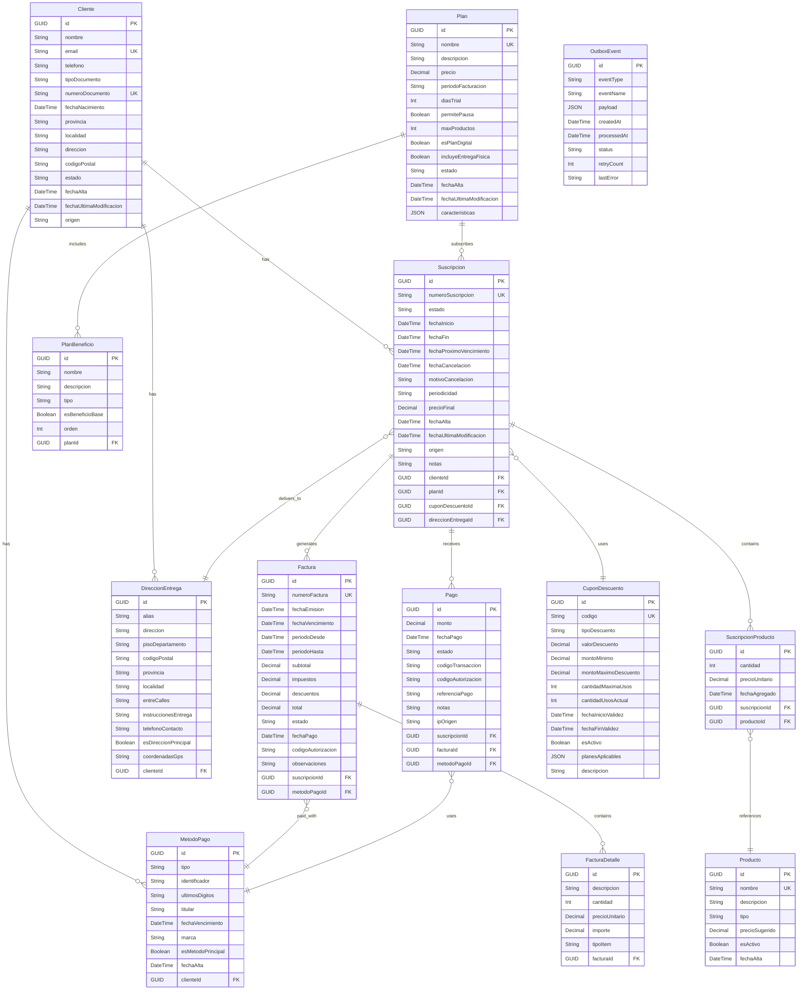

# Data Model Documentation

This document describes the data model for the **La Nación Suscripciones** system, including entity descriptions, field definitions, relationships, and an entity-relationship diagram.

> For schema management process and migration checklist, see `ai-specs/specs/schema-management.md`.
> For a reference MySQL schema that matches this model, see `ai-specs/specs/db/migrations/mysql/V001__suscripciones_init.sql`.

## Model Descriptions

### 1. Cliente
Represents a customer who can subscribe to one or more plans.

**Fields:**
- `id`: Unique identifier for the customer (Primary Key, GUID)
- `nombre`: Customer's full name (required, max 255 characters)
- `email`: Customer's unique email address (required, unique, max 255 characters)
- `telefono`: Customer's phone number (optional, max 20 characters)
- `tipoDocumento`: Document type (DNI/CUIT/CUIL) (required, max 10 characters)
- `numeroDocumento`: Document number (required, unique, max 20 characters)
- `fechaNacimiento`: Date of birth (optional)
- `provincia`: Province/State (optional, max 100 characters)
- `localidad`: City/Locality (optional, max 100 characters)
- `direccion`: Full address (optional, max 500 characters)
- `codigoPostal`: Postal code (optional, max 10 characters)
- `estado`: Customer status (Active/Inactive/Suspended) (required, default: Active)
- `fechaAlta`: Registration date (required, auto-set on creation)
- `fechaUltimaModificacion`: Last modification date (auto-updated)
- `origen`: Acquisition source (Web/CallCenter/Store/Partner) (optional)

**Validation Rules:**
- Email is required and must be unique
- Document number is required and must be unique per document type
- Estado must be one of: Activo, Inactivo, Suspendido

**Relationships:**
- `suscripciones`: One-to-many relationship with Suscripcion model
- `metodosPago`: One-to-many relationship with MetodoPago model
- `direccionesEntrega`: One-to-many relationship with DireccionEntrega model

### 2. Plan
Represents a subscription plan with pricing and terms.

**Fields:**
- `id`: Unique identifier for the plan (Primary Key, GUID)
- `nombre`: Plan name (required, max 100 characters)
- `descripcion`: Plan description (optional, max 500 characters)
- `precio`: Monthly price in local currency (required, decimal 18,2)
- `periodoFacturacion`: Billing period (Monthly/Quarterly/Annual) (required)
- `diasTrial`: Number of trial days (optional, default: 0)
- `permitePausa`: Allows subscription pause (required, default: false)
- `maxProductos`: Maximum products allowed (optional, default: null = unlimited)
- `esPlanDigital`: Digital-only plan flag (required, default: false)
- `incluyeEntregaFisica`: Includes physical delivery (required, default: false)
- `estado`: Plan status (Active/Inactive/Draft) (required, default: Draft)
- `fechaAlta`: Creation date (auto-set)
- `fechaUltimaModificacion`: Last modification date (auto-updated)
- `caracteristicas`: JSON field for plan features (optional)

**Validation Rules:**
- Precio must be greater than or equal to 0
- Nombre must be unique
- PeriodoFacturacion must be one of: Mensual, Trimestral, Anual

**Relationships:**
- `suscripciones`: One-to-many relationship with Suscripcion model
- `beneficios`: One-to-many relationship with PlanBeneficio model

### 3. Suscripcion
Represents a customer's subscription to a plan.

**Fields:**
- `id`: Unique identifier for the subscription (Primary Key, GUID)
- `clienteId`: Foreign key referencing the Cliente (required)
- `planId`: Foreign key referencing the Plan (required)
- `numeroSuscripcion`: Human-readable subscription number (required, unique)
- `estado`: Subscription status (Pending/Active/Paused/Cancelled/Expired) (required)
- `fechaInicio`: Start date (required)
- `fechaFin`: End date (optional, null if ongoing)
- `fechaProximoVencimiento`: Next billing date (required)
- `fechaCancelacion`: Cancellation date (optional)
- `motivoCancelacion`: Cancellation reason (optional, max 500 characters)
- `periodicidad`: Billing frequency (required)
- `precioFinal`: Final price after discounts (required)
- `cuponDescuentoId`: Applied discount coupon (optional)
- `direccionEntregaId`: Delivery address (optional, for physical plans)
- `notas`: Internal notes (optional, max 1000 characters)
- `fechaAlta`: Creation date (auto-set)
- `fechaUltimaModificacion`: Last modification date (auto-updated)
- `origen`: Subscription origin (Web/App/CallCenter/Store) (required)

**Validation Rules:**
- FechaInicio must be set
- Estado must be one of: Pendiente, Activa, Pausada, Cancelada, Vencida
- PrecioFinal must be greater than or equal to 0
- If Estado is Pausada, FechaPausa must be set

**Relationships:**
- `cliente`: Many-to-one relationship with Cliente model
- `plan`: Many-to-one relationship with Plan model
- `productos`: One-to-many relationship with SuscripcionProducto model
- `facturas`: One-to-many relationship with Factura model
- `pagos`: One-to-many relationship with Pago model
- `direccionEntrega`: Many-to-one relationship with DireccionEntrega model

### 4. PlanBeneficio
Represents features/benefits included in a plan.

**Fields:**
- `id`: Unique identifier for the benefit (Primary Key, GUID)
- `planId`: Foreign key referencing the Plan (required)
- `nombre`: Benefit name (required, max 100 characters)
- `descripcion`: Benefit description (optional, max 500 characters)
- `tipo`: Benefit type (DigitalAccess/PhysicalDelivery/Discount/Content) (required)
- `esBeneficioBase`: Is base benefit (included in all plans of this type) (required)
- `orden`: Display order (required, default: 0)

**Validation Rules:**
- Nombre must be unique per plan

**Relationships:**
- `plan`: Many-to-one relationship with Plan model

### 5. SuscripcionProducto
Represents products associated with a subscription.

**Fields:**
- `id`: Unique identifier (Primary Key, GUID)
- `suscripcionId`: Foreign key referencing the Suscripcion (required)
- `productoId`: Foreign key referencing the Producto (required)
- `cantidad`: Quantity (required, default: 1)
- `precioUnitario`: Unit price at subscription time (required)
- `fechaAgregado`: Date when product was added (auto-set)

**Validation Rules:**
- Cantidad must be greater than 0

**Relationships:**
- `suscripcion`: Many-to-one relationship with Suscripcion model
- `producto`: Many-to-one relationship with Producto model

### 6. Producto
Represents a product that can be included in subscriptions.

**Fields:**
- `id`: Unique identifier for the product (Primary Key, GUID)
- `nombre`: Product name (required, max 100 characters)
- `descripcion`: Product description (optional, max 500 characters)
- `tipo`: Product type (Newspaper/Magazine/Digital/Addon) (required)
- `precioSugerido`: Suggested retail price (optional)
- `esActivo`: Is active for new subscriptions (required, default: true)
- `fechaAlta`: Creation date (auto-set)

**Validation Rules:**
- Nombre must be unique

**Relationships:**
- `suscripcionesProductos`: One-to-many relationship with SuscripcionProducto model

### 7. DireccionEntrega
Represents delivery addresses for physical products.

**Fields:**
- `id`: Unique identifier (Primary Key, GUID)
- `clienteId`: Foreign key referencing the Cliente (required)
- `alias`: Address alias/nickname (required, max 50 characters)
- `direccion`: Street address (required, max 500 characters)
- `pisoDepartamento`: Floor/Apartment (optional, max 50 characters)
- `codigoPostal`: Postal code (required, max 10 characters)
- `provincia`: Province/State (required, max 100 characters)
- `localidad`: City/Locality (required, max 100 characters)
- `entreCalles`: Between streets (optional, max 200 characters)
- `instruccionesEntrega`: Delivery instructions (optional, max 500 characters)
- `telefonoContacto`: Contact phone (optional, max 20 characters)
- `esDireccionPrincipal`: Is primary address (required, default: false)
- `coordenadasGps`: GPS coordinates (optional, max 50 characters)

**Validation Rules:**
- Alias must be unique per customer

**Relationships:**
- `cliente`: Many-to-one relationship with Cliente model
- `suscripciones`: One-to-many relationship with Suscripcion model

### 8. MetodoPago
Represents payment methods for a customer.

**Fields:**
- `id`: Unique identifier (Primary Key, GUID)
- `clienteId`: Foreign key referencing the Cliente (required)
- `tipo`: Payment method type (CreditCard/DebitCard/MPAccount/TarjetaLN) (required)
- `identificador`: Payment method identifier/token (required)
- `ultimosDigitos`: Last 4 digits for display (required, max 4 characters)
- `titular`: Card/account holder name (required, max 100 characters)
- `fechaVencimiento`: Expiration date (optional, for cards)
- `marca`: Card brand (Visa/Mastercard/Amex/etc.) (optional)
- `esMetodoPrincipal`: Is primary payment method (required, default: false)
- `fechaAlta`: Creation date (auto-set)

**Validation Rules:**
- Tipo must be one of: TarjetaCredito, TarjetaDebito, CuentaMP, TarjetaLN

**Relationships:**
- `cliente`: Many-to-one relationship with Cliente model
- `pagos`: One-to-many relationship with Pago model

### 9. Factura
Represents an invoice for a subscription.

**Fields:**
- `id`: Unique identifier (Primary Key, GUID)
- `suscripcionId`: Foreign key referencing the Suscripcion (required)
- `numeroFactura`: Invoice number (required, unique)
- `fechaEmision`: Issue date (required)
- `fechaVencimiento`: Due date (required)
- `periodoDesde`: Billing period start (required)
- `periodoHasta`: Billing period end (required)
- `subtotal`: Subtotal before taxes (required)
- `impuestos`: Tax amount (required)
- `descuentos`: Discount amount (required)
- `total`: Final total (required)
- `estado`: Invoice status (Pending/Paid/Overdue/Cancelled) (required)
- `fechaPago`: Payment date (optional)
- `metodoPagoId`: Payment method used (optional)
- `codigoAutorizacion`: Authorization code from payment gateway (optional)
- `observaciones`: Invoice observations (optional)

**Validation Rules:**
- Total must be greater than or equal to 0
- Estado must be one of: Pendiente, Pagada, Vencida, Anulada

**Relationships:**
- `suscripcion`: Many-to-one relationship with Suscripcion model
- `metodoPago`: Many-to-one relationship with MetodoPago model
- `detalles`: One-to-many relationship with FacturaDetalle model

### 10. FacturaDetalle
Represents line items on an invoice.

**Fields:**
- `id`: Unique identifier (Primary Key, GUID)
- `facturaId`: Foreign key referencing the Factura (required)
- `descripcion`: Item description (required, max 500 characters)
- `cantidad`: Quantity (required, default: 1)
- `precioUnitario`: Unit price (required)
- `importe`: Total line amount (required)
- `tipoItem`: Item type (Product/Service/Discount/Tax) (required)

**Validation Rules:**
- Importe must be greater than or equal to 0

**Relationships:**
- `factura`: Many-to-one relationship with Factura model

### 11. Pago
Represents a payment transaction.

**Fields:**
- `id`: Unique identifier (Primary Key, GUID)
- `suscripcionId`: Foreign key referencing the Suscripcion (required)
- `facturaId`: Foreign key referencing the Factura (required)
- `metodoPagoId`: Foreign key referencing the MetodoPago (required)
- `monto`: Payment amount (required)
- `fechaPago`: Payment date (required)
- `estado`: Payment status (Pending/Completed/Failed/Refunded) (required)
- `codigoTransaccion`: Transaction code from payment gateway (required)
- `codigoAutorizacion`: Authorization code (optional)
- `referenciaPago`: External reference (optional)
- `notas`: Payment notes (optional)
- `ipOrigen`: Origin IP address (optional)

**Validation Rules:**
- Monto must be greater than 0
- Estado must be one of: Pendiente, Completado, Fallido, Reembolsado

**Relationships:**
- `suscripcion`: Many-to-one relationship with Suscripcion model
- `factura`: Many-to-one relationship with Factura model
- `metodoPago`: Many-to-one relationship with MetodoPago model

### 12. CuponDescuento
Represents discount coupons.

**Fields:**
- `id`: Unique identifier (Primary Key, GUID)
- `codigo`: Coupon code (required, unique, max 50 characters)
- `tipoDescuento`: Discount type (Percentage/FixedAmount) (required)
- `valorDescuento`: Discount value (required)
- `montoMinimo`: Minimum purchase amount (optional)
- `montoMaximoDescuento`: Maximum discount amount (optional, for percentage)
- `cantidadMaximaUsos`: Maximum total uses (optional, null = unlimited)
- `cantidadUsosActual`: Current usage count (auto-updated)
- `fechaInicioValidez`: Validity start date (required)
- `fechaFinValidez`: Validity end date (required)
- `esActivo`: Is active (required, default: true)
- `planesAplicables`: JSON array of applicable plan IDs (optional, null = all)
- `descripcion`: Coupon description (optional)

**Validation Rules:**
- ValorDescuento must be greater than 0
- If TipoDescuento is Percentage, ValorDescuento must be <= 100
- FechaFinValidez must be greater than FechaInicioValidez

**Relationships:**
- `suscripciones`: One-to-many relationship with Suscripcion model

### 13. OutboxEvent
Stores events to be published (Outbox Pattern for transactional messaging).

**Fields:**
- `id`: Unique identifier (Primary Key, GUID)
- `eventType`: Event type name (required, max 100 characters)
- `eventName`: Full event name (required, max 200 characters)
- `payload`: JSON event payload (required)
- `createdAt`: Creation timestamp (required, auto-set)
- `processedAt`: Processing timestamp (optional)
- `status`: Processing status (Pending/Processed/Failed) (required, default: Pending)
- `retryCount`: Number of retry attempts (required, default: 0)
- `lastError`: Last error message (optional)

**Validation Rules:**
- Status must be one of: Pendiente, Procesado, Fallido

**Relationships:**
- None (this is a technical table for event publishing)

## Entity Relationship Diagram



## Key Design Principles

1. **Referential Integrity**: All foreign key relationships ensure data consistency across the system.

2. **Subscription Lifecycle**: The model supports complete subscription lifecycle (Pending → Active → Paused → Cancelled/Expired).

3. **Billing Separation**: Invoices and payments are separated from subscriptions to support complex billing scenarios.

4. **Outbox Pattern**: The `OutboxEvent` table enables reliable event publishing within transactions.

5. **Flexible Delivery**: Supports both digital-only and physical delivery subscriptions with multiple addresses.

6. **Multi-Payment Support**: Customers can have multiple payment methods with a primary designation.

7. **Discount Coupons**: Supports percentage and fixed-amount discounts with usage limits.

## Indexes

The following indexes are recommended for optimal query performance:

```sql
-- Cliente indexes
CREATE INDEX IX_Cliente_Email ON Cliente(Email);
CREATE INDEX IX_Cliente_TipoNumeroDocumento ON Cliente(TipoDocumento, NumeroDocumento);
CREATE INDEX IX_Cliente_Estado ON Cliente(Estado);

-- Suscripcion indexes
CREATE INDEX IX_Suscripcion_ClienteId ON Suscripcion(ClienteId);
CREATE INDEX IX_Suscripcion_PlanId ON Suscripcion(PlanId);
CREATE INDEX IX_Suscripcion_NumeroSuscripcion ON Suscripcion(NumeroSuscripcion);
CREATE INDEX IX_Suscripcion_Estado ON Suscripcion(Estado);
CREATE INDEX IX_Suscripcion_FechaProximoVencimiento ON Suscripcion(FechaProximoVencimiento);

-- Factura indexes
CREATE INDEX IX_Factura_SuscripcionId ON Factura(SuscripcionId);
CREATE INDEX IX_Factura_NumeroFactura ON Factura(NumeroFactura);
CREATE INDEX IX_Factura_Estado ON Factura(Estado);

-- Pago indexes
CREATE INDEX IX_Pago_SuscripcionId ON Pago(SuscripcionId);
CREATE INDEX IX_Pago_FacturaId ON Pago(FacturaId);
CREATE INDEX IX_Pago_CodigoTransaccion ON Pago(CodigoTransaccion);

-- OutboxEvent indexes
CREATE INDEX IX_OutboxEvent_Status_CreatedAt ON OutboxEvent(Status, CreatedAt);
```

## Notes

- All `id` fields use GUID/UUID for global uniqueness
- All `fechaAlta` fields are auto-set on record creation
- All `fechaUltimaModificacion` fields are auto-updated on modifications
- Soft delete patterns may be applied using `Estado` field
- JSON fields (`caracteristicas`, `planesAplicables`) allow flexible schema extension
- Audit fields (`CreatedBy`, `ModifiedBy`) should be added for production
